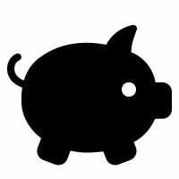

# Budget Tracker (PWA - Online/Offline App)

<!-- image credit: this image is from icons8-->

 ## Table of Contents
  - [Description / Objective](#description--objective)
  - [Links](#links)
  - [Screen Captures](#screen-captures)
  - [User Story](#user-story)
  - [Business Need](#business-need)
  - [Acceptance Criteria](#acceptance-criteria)
  - [Key Features](#key-features)
  - [Tools](#tools)
  - [Installation](#installation)
  - [Use](#use)
  - [License](#license)
  - [Contributors](#contributors)
  - [References](#references)
  - [Tests](#tests)
  - [Questions](#questions)

  ## Description / Objective
    The objective of this project is to enable a user to add expenses and deposits to their budget with or without an internet connection. When entering transactions offline, the totals populate when brought back online.

  ## Links
  ### Github Repository 
  [Budget Tracker on Github](https://github.com/NDaruwalla/budget-tracker)

  ### Heroku Link 
  [Budget Tracker on Heroku](https://secure-tor-71259.herokuapp.com/)

  ## Screen Captures & Video

  ### Budget Tracker Application Homepage
  
  Image of the Budget Tracker application page showing details about the user's financial transactions.

  

  ### Budget Tracker Video Demonstration
  [YouTube video of application](https://youtu.be/OKlLmU6Ry0Q/)


  ## User Story 
   ```md
    AS AN avid traveller
    I WANT to be able to track my withdrawals and deposits with or without a data/internet connection
    SO THAT my account balance is accurate when I am traveling
  ```
  ## Business Need

    Users need to accurately and conveniently track finances. 

  ## Acceptance Criteria
  ```md
    GIVEN a user is on Budget App without an internet connection
    WHEN the user inputs a withdrawal or deposit
    THEN that will be shown on the page, and added to their transaction history when their connection is back online.
  ```
  ## Key Features 
    The key features of this application include:

    * buttons to add and subtract funds from total
    * graph visualization of total funds over time
    * download enabled for offline use
    * automatically updates offline data when user returns online
    

  ## Tools
  The tools used to create this application include: HTML, CSS, JavaScript, Indexed DB, Mongo DB, mongoose, Node, Dotenv, Express, Heroku, Github, Git Bash, and Visual Studio Code.

  ## Installation
  The following packages were installed:

    * Dotenv
    * Express
    * Mongoose
    * Mongo
    * Morgan
    * Nodemon
   
  ## Use
  To use this application to keep track of finances (online and offline), follow the following steps:

  1. Clone this repository to your local machine.
  2. Run npm install to install the dependencies noted in the Installation section of this document. 
  3. Run node server.js to start the application.

  ## License
  MIT
  
  [](https://opensource.org/licenses/MIT)  
  
  Click badge for license description.
  
  ## Contributors
  Nicole Daruwalla 

  ## References
  The following references were used to create this application:

  - Assignment Readme
  - https://developer.mozilla.org/en-US/docs/Web/API/IndexedDB_API
  - https://www.youtube.com/watch?v=g4U5WRzHitM
  - https://www.youtube.com/watch?v=vb7fkBeblcw&t=1342s
  - https://docs.npmjs.com/
  - https://docs.mongodb.com/guides/
  - https://mongoosejs.com/docs/
  - https://docs.mongodb.com/manual
  - https://mongoosejs.com


  ## Tests
  No tests are available at this time

  ## Questions
  If you have questions or need help with this application:

  Contact me on GitHub:
  [ndaruwalla](https://github.com/ndaruwalla)
 
  Or, via [Email](mailto:nicole.daruwalla@gmail.com)

